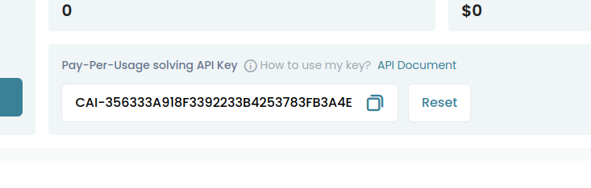

# python3-captchaai


[](https://badge.fury.io/py/python3-captchaai)
[](https://badge.fury.io/py/python3-captchaai)
[](https://pepy.tech/project/python3-captchaai)

[](https://codeclimate.com/github/AndreiDrang/python3-captchaai/maintainability)

[](https://github.com/AndreiDrang/python3-captchaai/actions/workflows/test_build.yml)
[](https://github.com/AndreiDrang/python3-captchaai/actions/workflows/install.yml)
[](https://github.com/AndreiDrang/python3-captchaai/actions/workflows/test.yml)
[](https://github.com/AndreiDrang/python3-captchaai/actions/workflows/lint.yml)


Python3 library for [CaptchaAI](https://www.captchaai.io/) service API.

Tested on UNIX based OS.

The library is intended for software developers and is used to work with the [CaptchaAI](https://www.captchaai.io/) service API.

***

If you have any questions, please send a message to the [Telegram](https://t.me/pythoncaptcha) chat room.

Or email python-captcha@pm.me

***

## How to install?

### pip

```bash
pip install python3-captchaai
```

### Source
```bash
git clone https://github.com/AndreiDrang/python3-captchaai.git
cd python3-captchaai
python setup.py install
```

### Changelog

v.0.0.1 - First release with basic methods and logic.

***

### Additional info
1. [All examples of working with the library](src/examples)
2. [CaptchaAI errors list](https://captchaai.atlassian.net/wiki/spaces/CAPTCHAAI/pages/426145/errorCode+full+list+of+errors)


### Get API Key to work with the library
1. On the page - https://dashboard.captchaai.io/overview/user-center
2. Find it: 
