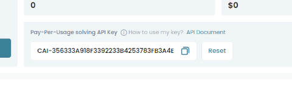

# python3-capsolver


[](https://dashboard.capsolver.com/passport/register?inviteCode=kQTn-tG07Jb1)

[](https://badge.fury.io/py/python3-capsolver)
[](https://badge.fury.io/py/python3-capsolver)
[](https://pepy.tech/project/python3-capsolver)

[](https://codeclimate.com/github/AndreiDrang/python3-capsolver/maintainability)
[](https://www.codacy.com/gh/AndreiDrang/python3-capsolver/dashboard?utm_source=github.com&amp;utm_medium=referral&amp;utm_content=AndreiDrang/python3-capsolver&amp;utm_campaign=Badge_Grade)
[](https://codecov.io/gh/AndreiDrang/python3-capsolver)

[](https://github.com/AndreiDrang/python3-capsolver/actions/workflows/test_build.yml)
[](https://github.com/AndreiDrang/python3-capsolver/actions/workflows/install.yml)
[](https://github.com/AndreiDrang/python3-capsolver/actions/workflows/test.yml)
[](https://github.com/AndreiDrang/python3-capsolver/actions/workflows/lint.yml)


Python 3 library for [Capsolver](https://dashboard.capsolver.com/passport/register?inviteCode=kQTn-tG07Jb1) service API.

Tested on UNIX based OS.

The library is intended for software developers and is used to work with the [Capsolver](https://dashboard.capsolver.com/passport/register?inviteCode=kQTn-tG07Jb1) service API.

***

If you have any questions, please send a message to the [Telegram](https://t.me/pythoncaptcha) chat room.

Or email python-captcha@pm.me

***

## How to install?

We recommend using the latest version of Python. `python3-capsolver` supports Python 3.7+.

### pip

```bash
pip install python3-capsolver
```

## How to use?

Is described in the [documentation-website](https://andreidrang.github.io/python3-capsolver/).


## How to test?

1. You need set ``API_KEY`` in your environment(get this value from you account).
2. Run command ``make tests``, from root directory.

### How to get API Key to work with the library
1. On the page - https://dashboard.capsolver.com/overview/user-center
2. Find it: 
