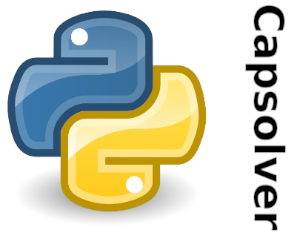

.. rst-class:: hide-header

python3-capsolver
=================

Python3 library for `Capsolver API <https://dashboard.capsolver.com/passport/register?inviteCode=kQTn-tG07Jb1>`_.

The library is intended for software developers and is used to work with the `Capsolver API <https://dashboard.capsolver.com/passport/register?inviteCode=kQTn-tG07Jb1)>`_.

.. toctree::
   :maxdepth: 1
   :caption: Start here:

   modules/main/info.md
   modules/other-libs/info.md
   modules/license/info.md
   modules/contacts/info.md

.. toctree::
   :maxdepth: 3
   :caption: Captcha examples:

   modules/image-to-text/example.rst
   modules/re-captcha/example.rst
   modules/h-captcha/example.rst
   modules/gee-test/example.rst
   modules/fun-captcha/example.rst
   modules/datadome/example.rst
   modules/mt-captcha/example.rst
   modules/cloudflare/example.rst
   modules/aws-waf/example.rst
   modules/cyber-si-ara/example.rst

.. toctree::
   :maxdepth: 2
   :caption: Additional modules

   modules/enum/info.rst
   modules/serializer/info.rst
